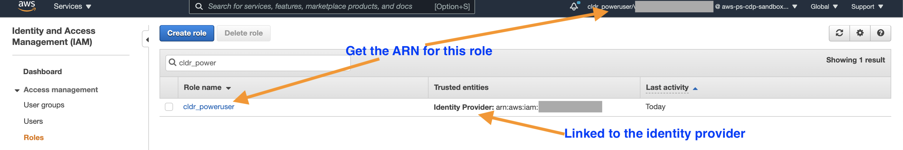

# AWS CLI setup

## Using AWS Cloudshell
If you do not want to setup AWS CLI on your machine, then you can use the AWS Cloudshell to run the AWS commands. From the AWS portal, click the shell icon.  
   


The AWS Cloudshell will launch in a new window.   
   


## Install & Configure AWS CLI
If you would like to install & configure AWS CLI on your machine instead of using AWS Cloudshell follow this section of the document.

### AWS CLI Installation
Install AWS CLI following the instructions documented here - https://docs.aws.amazon.com/cli/latest/userguide/install-cliv2.html

### Configuration

#### Option 1 - Using Access key ID & Secret access key
If you have a `Access key ID` and `Secret access key`, then you can run the `aws configure` command to setup the CLI. Additional instructions can be found here - https://docs.aws.amazon.com/cli/latest/userguide/cli-chap-configure.html

#### Option 2 - Using SAML token
If you are unable to use the `Access key ID` and `Secret access key` approach and are using `SAML` authentication to login to the AWS portal, then you use the steps documented in this section to get temporary AWS credentials for CLI access.
- Detailed steps are documented here - https://aws.amazon.com/premiumsupport/knowledge-center/aws-cli-call-store-saml-credentials.  
- Collect the SAML response as per instructions in the article. You can optionally use the [SAML-tracer Chrome extension](https://chrome.google.com/webstore/detail/saml-tracer/mpdajninpobndbfcldcmbpnnbhibjmch?hl=en). Copy the entire `SAML Response` and save it in a file `samlresponse.log`   
   
      
- Collect the following details from the AWS account -   
    - ARN of the Identity provider. For e.g. `arn:aws:iam::123456789012:saml-provider/CLDR_Okta`  
         
          
    - ARN of the role to be assumed. This is the role that you assume when you login via your IDP. For e.g. `arn:aws:iam::123456789012:role/cldr_poweruser`   
       
             
- After collecting the SAML response, you can run the wrapper script `get-aws-credentials.sh` as shown - 
    ```
    ./get-aws-credentials.sh \
        "arn:aws:iam::123456789012:role/cldr_poweruser" \
        "arn:aws:iam::123456789012:saml-provider/CLDR_Okta" \
        samlresponse.log
    ```
- When the script completes successfully, it will export the temporary AWS credentials to the default AWS profile. You should now be able to run the AWS commands.
- If you get the error `An error occurred (ExpiredToken) when calling ........operation: The provided token has expired`, This means that the credentials have expired and you will have to re-execute the above steps to gain access.
